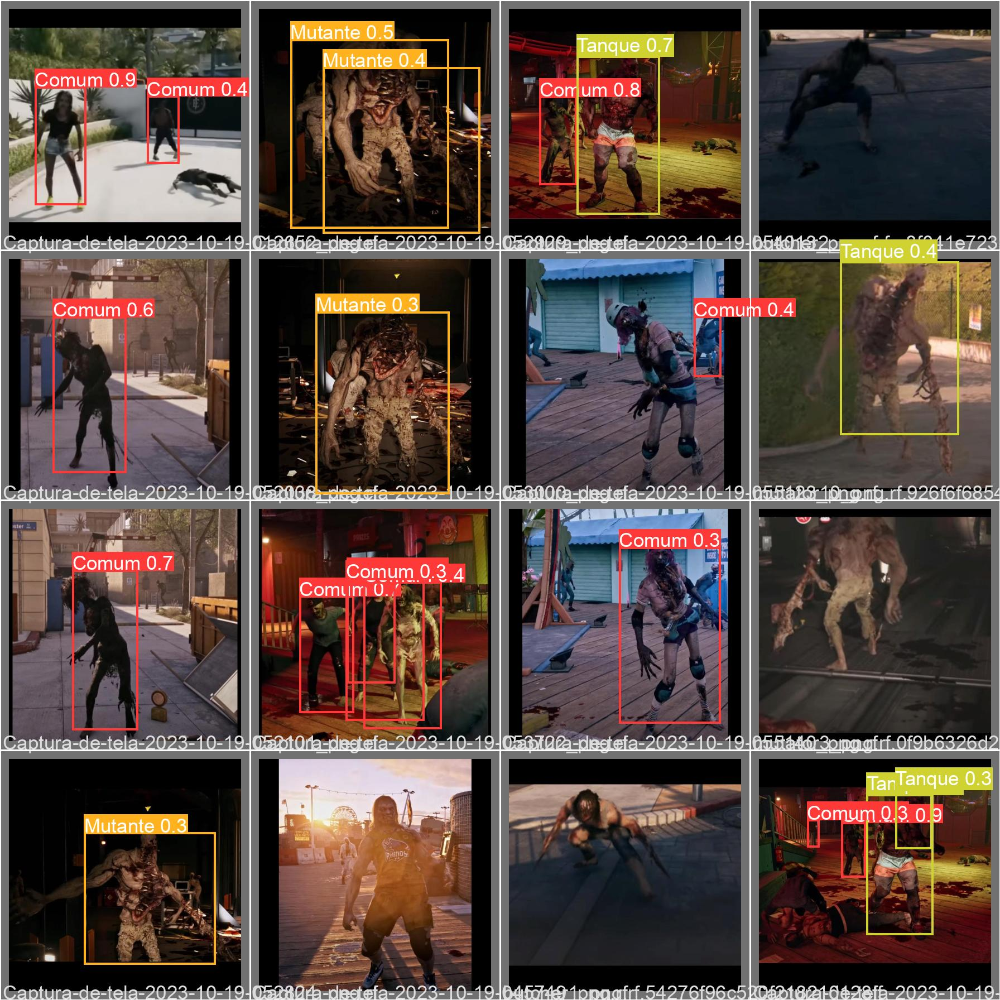

# Sistema de sobrevivência APOCALIPZE

## Introdução à história

O sistema de sobrevivência APOCALIPZE surge como uma esperança aos sobreviventes do caos do mundo apocalíptico, trazendo ferramentas essenciais para orientar e auxiliar os seres humanos restantes. Dividido em duas frentes, a primeira para estudo dos espécimes de mortos-vivos e a segunda para combate, o sistema APOCALIPZE tem o objetivo de oferecer um conjunto de recursos e informações que permitam aos sobreviventes enfrentar os zumbis e garantir sua segurança. 

A primeira parte consiste em um sistema para catálogo de espécimes vistos no dia a dia, uma função primordial para a análise e reconhecimento de possíveis padroes entre os zumbis, para assim poder adotar estratégias mais efetivas contra cada tipo.

A segunda parte é composta por um software que utiliza inteligência artificial de última geração, treinada com fotos dos espécimes avistados pela nossa equipe. Nossa IA assistente é capaz de identificar o zumbi avistado e encontrar seus pontos fortes e fracos. Assim, atribui um score de periculosidade, envia ações de defesa e ataque diretamente ao chip implantado nos patos altamente treinados da espécie *Anas platyrhynchos* , que é imune aos zumbis, pois não são rastreados por eles.

Além disso, conseguimos identificar atributos (força, velocidade e inteligência) dos mortos-vivos por meio de cálculos "muito avançados".

Link para o vídeo apresentação: [link](https://youtu.be/0HX4v13aovs)

## Descrição do projeto

Projeto realizado para a etapa bônus do DSIN CODER CHALLENGE 2023.

Criado por Natália Alves Brito.

## Ferramentas e tecnologias

Projeto todo realizado em python, bibliotecas utilizadas:

- PySimpleGui para interface e interação com usuário

- Numpy para geração de  banco de dados falso e aleatório

- Pandas para armazenamento dos dados falsos em formato de DataFrames, facilitando o manejo

- PyTorch para treinamento do modelo de inteligência artificial YOLOv5 utilizado para visão computacional

## Criação do dataset para treinamento da IA

O dataset utilizado para treinamento foi construído por mim, capturando 401 imagens do jogo Dead Island 2, após o processo de geração de variações feito no Roboflow, o dataset final possui 971 imagens totais.

As classes foram pensadas de acordo com os atributos definidos na situação problema.

Uma breve explicação das classes e o respectivo zumbi utilizado do jogo:

- Mutante -> Um zumbi com todos os atributos acima da média, pensado para ser muito forte e difícil de lidar -> mutator

- Tanque -> Um zumbi forte e resistente, porém lento -> crusher

- Corredor -> Um zumbi muito ágil, porém pouco resistente -> butcher

- Estrategista -> Um zumbi que consegue pensar estrategicamente, pois possui inteligência acima da média -> screamer

- Comum -> Um zumbi comum, que não se destaca em muita coisa -> walker

Pode acessar pelo link para o dataset de imagens criado: [Dataset](https://universe.roboflow.com/natlia-brito/zombie-class-decection)

## 1 - Sistema de catálogo de zumbis

### Situação problema do desafio:

Durante o período apocalíptico, constatamos que haviam zumbis com grau de velocidade, raciocínio e força diferentes, sendo alguns incrivelmente fortes, rápidos e espertos enquanto outros apenas rastejavam e praticamente não causavam perigo. Não sabemos o que leva cada um a ser diferente do outro e, por isso, precisamos de um sistema que seja capaz de catalogar as principais informações de potenciais hospedeiros:

- Idade

- Sexo

- Peso e Altura

- Tipo Sanguíneo

- Gosto Musical: Pop; Rock; Pagode; Sertanejo; Hip-Hop/Rap; Eletrônica; Funk; Metal; Demais gêneros estranhos.

- Pratica qual esporte: Futebol; Basquete; Vôlei; Luta; Atletismo; eSports; Nada.

- Jogo preferido: Counter-Strike; Minecraft; Fortnite; The Witcher; Valorant; Assassin's Creed; World of Warcraft; FIFA; League of Legends; Dota; Rocket League; Outro - pouco relevante.

### Sistema construído:

Consiste em um sistema catalogador, onde será possível realizar as seguintes operações: adicionar um zumbi novo e suas características, deletar um zumbi dos dados e visualizar todos os zumbis catalogados ou apenas 1 específico.

As informações armazenadas no sistema são: idade, sexo, peso, altura, tipo sanguíneo, gosto musical, esporte e jogo favorito.

O arquivo está nomeado como "sistema_catalogo.py".

Além disso, também criei um banco de dados fictício com informações aleatórias para os zumbis, das quais, idade, sexo, peso e altura foram geradas de acordo com a distribuição estatística da população brasileira, para se aproximar ainda mais de um cenário real.

## 2 - Algoritmo que da os atributos dos zumbis com base nas características

### Situação problema do desafio:

Uma vez catalogadas as informações dos hospedeiros, é necessário desenvolver um algoritmo capaz de, com base nos dados do hospedeiro, classificar os atributos do zumbi, tais como força, velocidade e inteligência:

Exemplo: suponha que o hospedeiro está na faixa dos 18-30 e prática ao menos um esporte (que não seja eSport) o mesmo tende a ter força maior; trabalhe com escala de 1 a 100 no quesito força, velocidade e inteligência.

Seja criativo, e aproveite bem os dados catalogados.

### Lógica para o algoritmo:

Defini um valor base para os atributos (30) e a partir dele acrescentei ou diminui o resultado final de acordo com certas características do zumbi, por exemplo:

- divisão entre masculino (M) e feminino (F) -> M ganha mais 30 em força, enquanto F ganha mais 15 em velocidade e 25 em inteligência

- esporte favorito: vôlei e luta darão mais força, pois necessitam de mais movimentos robustos; futebol e atletismo darão mais velocidade, pois são modalidades que se beneficiam de movimentos ágeis; basquete e eSports darão inteligência, necessitam de noção de movimentação do seu time e do inimigo para escolher as melhores jogadas; se não possui esporte favorito, ou seja, está na categoria "Nada", o indivíduo perde 20 de velocidade e 20 de força porque provavelmente está sedentário.

Esse algoritmo está no arquivo "gerador_banco_dados.py".

## 3 - Sistema de ajuda ao pato de combate

### Situação problema do desafio:

No auge dos ataques, uma equipe de cientistas descobriu que os zumbis estavam atacando ferozmente não apenas a raça humana, mas também todos os outros animais, com uma única exceção notável: a espécie de pato conhecida como Anas platyrhynchos. Curiosamente, os zumbis pareciam ter dificuldade em identificar e farejar esses patos, o que levou a uma série de teorias e pesquisas sobre a misteriosa imunidade dos patos ao apocalipse zumbi.

Os cientistas criaram um chip que será implantado nos patos. Sua missão é criar um sistema a ser embarcado no chip, que seja capaz de:

- Identificar o zumbi e, com base nos seus atributos cadastrados, atribuir um score de periculosidade (quanto mais forte, rápido e inteligente, mais perigoso!);

- O sistema deverá identificar os pontos fracos do zumbi;

- O sistema deverá criar e acionar escudos e proteções contra os principais atributos dos zumbis; ex.: se um zumbi é rápido, o sistema pode sugerir que o pato alce voo.

- O sistema deverá equipar os patos com ataques que explorem os pontos fracos e eliminem os zumbis;

### Sistema construído:

Inteligência artificial do modelo YOLOv5 treinada para identificar os zumbis pela imagem e classificá-los (tanque, corredor, estrategista, mutante e comum), as classes foram pensadas de acordo com os atributos força, velocidade e inteligência. O score de periculosidade também é atribuído de acordo com o tipo do zumbi.

Interface foi construída para poder ser realizada a simulação do ambiente real, onde é mostrada uma imagem aleatória e ações são sugeridas para o pato a partir dela. Está no arquivo "auxilio_pato_IA.py".

## Versões da IA e evolução

- Versão 1.0

- Versão 3.0

- Versão 5.0

- Versão 6.0

